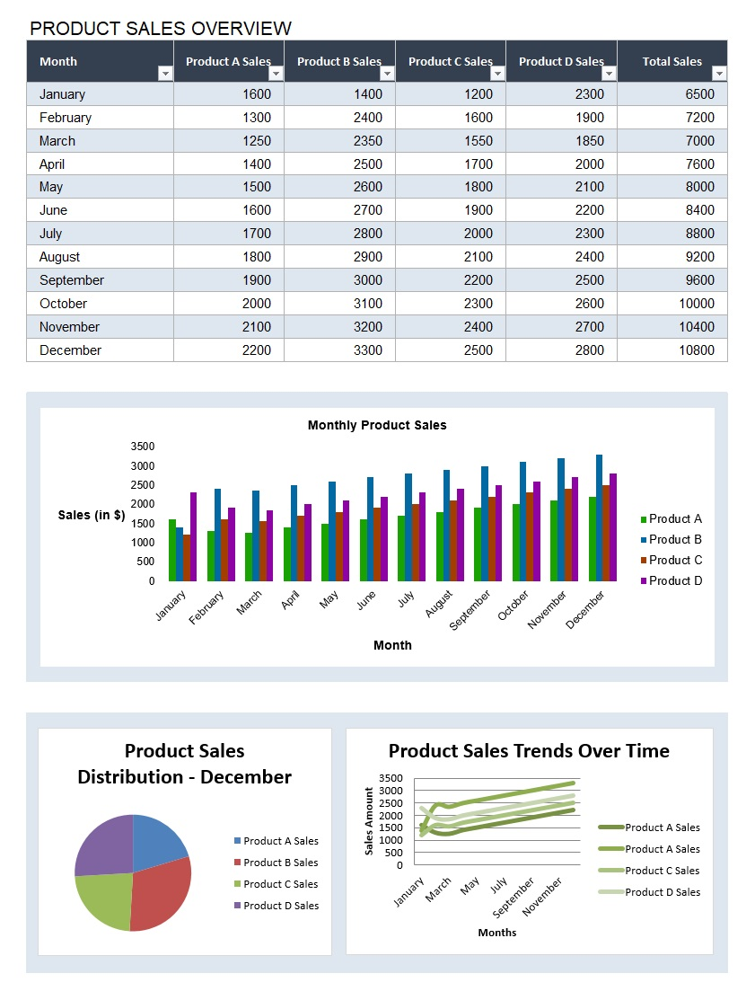

# EasyExcelGenerate

  

## Overview

EasyExcelGenerate is a robust C# tool for generating, updating, and saving Excel files with integrated chart data. Using the EPPlus library, this project populates Excel worksheets with product sales data, updates various chart types (bar, pie, line), and saves the newly generated report. It's designed for fast and dynamic Excel file handling with a focus on chart updates for tracking reports.

The purpose of this project is to serve as a quick demo on how to use an Excel template to build a spreadsheet with tables and various types of charts, such as bar, pie, and line charts. The code demonstrates how to automatically populate the template with data and update the charts accordingly.

## Features

- **Excel File Generation:** Populates Excel sheets with product sales data from a predefined dataset.
- **Chart Updates:** Dynamically updates bar, pie, and line charts in the Excel sheet based on the data provided.
- **Template-Based:** Uses an existing Excel template to structure the output file, simplifying customization.
- **Non-Commercial License:** Uses EPPlus under a non-commercial license.
- **User-Friendly:** Easy to set up and run in any environment with minimal configuration.

## Requirements

- .NET Core 5.0+
- EPPlus library for Excel file manipulation

## Installation

1. **.NET Core SDK:** Ensure you have .NET Core 5.0 or later installed. [Download here](https://dotnet.microsoft.com/download).
2. **EPPlus Library:** The project already includes the necessary libraries in the `csproj` file, so there's no need for additional installation.

## Usage

### Step 1: Clone the Repository

Clone the repository and navigate to the directory:
```sh
git clone https://github.com/yourusername/EasyExcelGenerate.git
cd EasyExcelGenerate
```

### Step 2: Set Up Your Excel Template

Make sure the `Invoice_Template.xlsx` file is located in the `/docs/` folder. The script will populate this template with data.

### Step 3: Execute the Program

Run the program from the terminal or your IDE:
```sh
dotnet run
```

This will generate a new Excel file (`Populated_Invoice_With_Charts.xlsx`) with updated charts and product sales data based on the pre-defined dataset.

### Step 4: Customize Data (Optional)

Modify the `ProductDataStore.cs` file to adjust the product sales data or add new products and sales values. The charts will automatically reflect these changes.

## Project Structure

```plaintext
EasyExcelGenerate
│   ├── EasyExcelGenerate.sln
│   ├── EasyExcelGenerate
│   │   ├── docs
│   │   │   ├── Invoice_Template.xlsx
│   │   │   ├── Template.jpg
│   │   ├── EasyExcelGenerate.csproj
│   │   ├── Product.cs
│   │   ├── ProductDataStore.cs
│   │   ├── Program.cs
```



## Author

This project was created by [Gitrep77](https://github.com/Gitrep77). If you find it helpful, feel free to give a star on the repository!

## Support

For issues or questions, open an issue on the [GitHub repository](https://github.com/Gitrep77/EasyExcelGenerate/issues).

## Contributing

We welcome contributions! Please read our [contributing guidelines](CONTRIBUTING.md) for more details.

## License

This project is licensed under the MIT License. See the [LICENSE](LICENSE) file for details.
